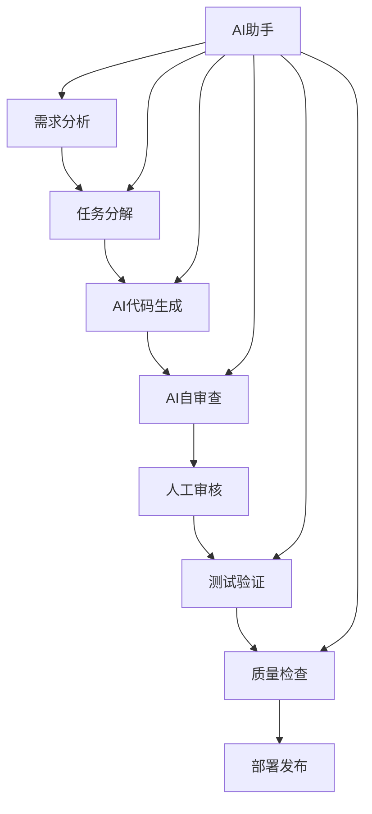

# AI驱动开发指南 - 健身房SaaS系统

> 🤖 **全程AI驱动开发** - 让AI成为你最强大的开发伙伴

## 📖 概述

本项目采用全新的AI驱动开发模式，通过人工智能大模型的强大能力，实现高效、高质量的软件开发。我们为健身房多品牌管理SaaS系统的开发准备了完整的AI工具链和最佳实践。

### 🎯 AI开发优势

- ⚡ **10-20倍开发速度提升**：AI自动生成代码框架和业务逻辑
- 🎯 **一致的代码质量**：遵循最佳实践和项目规范
- 📚 **知识整合**：集成多种技术栈的最佳经验
- 🔄 **快速迭代**：需求变更响应迅速
- 🧪 **全面测试**：自动生成完整的测试用例
- 📝 **完善文档**：自动生成API文档和代码注释

## 🏗️ AI开发架构

```
.ai/
├── config/                 # AI配置文件
│   └── ai-development-config.yml
├── prompts/                # 提示词模板库
│   └── templates.md
├── context/                # 项目上下文信息
│   └── project-context.md
├── scripts/                # 自动化脚本
│   └── ai-workflow.sh
├── output/                 # AI生成的输出
├── logs/                   # 开发日志
├── cache/                  # 缓存文件
└── README.md              # 本文档
```

## 🚀 快速开始

### 1. 环境准备

#### 必备工具
```bash
# 基础开发工具
node --version    # >= 18.0.0
npm --version     # >= 8.0.0
git --version     # >= 2.30.0
docker --version  # >= 20.0.0

# AI开发工具
# GitHub Copilot (VS Code插件)
# Claude API访问权限
# ChatGPT Plus订阅
```

#### AI工具配置
```bash
# 安装VS Code AI插件
code --install-extension github.copilot
code --install-extension github.copilot-chat
code --install-extension continue.continue

# 配置环境变量
export OPENAI_API_KEY="your-openai-key"
export ANTHROPIC_API_KEY="your-claude-key"
```

### 2. 初始化AI开发环境

```bash
# 克隆项目
git clone <repository-url>
cd saas

# 初始化AI开发环境
chmod +x .ai/scripts/ai-workflow.sh
./.ai/scripts/ai-workflow.sh init

# 验证环境
./.ai/scripts/ai-workflow.sh help
```

### 3. 第一个AI开发任务

```bash
# 1. 分解开发任务
./.ai/scripts/ai-workflow.sh breakdown "实现用户管理模块"

# 2. 生成代码
./.ai/scripts/ai-workflow.sh generate user entity
./.ai/scripts/ai-workflow.sh generate user service
./.ai/scripts/ai-workflow.sh generate user controller

# 3. 生成测试
./.ai/scripts/ai-workflow.sh test src/user/user.service.ts unit

# 4. 代码审查
./.ai/scripts/ai-workflow.sh review src/user/user.service.ts

# 5. 质量检查
./.ai/scripts/ai-workflow.sh quality
```

## 🛠️ AI工具链

### 核心AI模型

| AI模型 | 用途 | 优势 |
|--------|------|------|
| **Claude 3.5 Sonnet** | 架构设计、复杂逻辑 | 推理能力强、代码质量高 |
| **GPT-4** | 文档生成、需求分析 | 语言理解好、创意丰富 |
| **GitHub Copilot** | 实时代码补全 | 上下文感知、速度快 |
| **Cursor IDE** | AI原生开发环境 | 深度集成、体验流畅 |

### 专业AI助手

#### 1. 架构设计助手
```markdown
# 使用Claude进行系统架构设计
角色：资深系统架构师
任务：设计微服务架构
输出：架构图、技术选型、部署方案
```

#### 2. 代码生成助手
```markdown
# 使用模板化提示词生成代码
模板：.ai/prompts/templates.md
配置：.ai/config/ai-development-config.yml
输出：完整的代码实现 + 测试用例
```

#### 3. 质量保证助手
```markdown
# AI代码审查和优化
检查：功能性、安全性、性能、可维护性
输出：问题列表、改进建议、重构方案
```

## 📝 提示词工程

### 提示词模板库

我们提供了完整的提示词模板库，覆盖开发的各个阶段：

#### 后端开发模板
- 🏗️ **实体类生成**：TypeORM实体、关联关系、索引设计
- ⚙️ **Service层生成**：业务逻辑、事务管理、缓存策略
- 🌐 **Controller层生成**：RESTful API、参数验证、权限控制

#### 前端开发模板
- 🎨 **Vue组件生成**：Composition API、TypeScript、响应式设计
- 📡 **API客户端生成**：Axios封装、类型安全、错误处理

#### 小程序开发模板
- 📱 **页面生成**：磨砂玻璃风格、微信API集成
- 🧩 **组件生成**：可复用组件、性能优化

#### 测试开发模板
- 🧪 **单元测试**：Jest、Mock、覆盖率
- 🔗 **集成测试**：Supertest、端到端测试

### 提示词最佳实践

#### 1. 结构化提示词
```markdown
## 角色定义
你是一个资深的[专业领域]工程师...

## 项目背景
健身房多品牌管理SaaS系统...

## 技术约束
- 使用NestJS + TypeScript
- 遵循SOLID原则
- 实现完整的错误处理

## 具体任务
[详细的任务描述]

## 输出要求
1. 完整的代码实现
2. 相关的测试用例
3. 详细的文档注释
```

#### 2. 上下文注入
```markdown
**项目上下文**：
- 当前技术栈：NestJS + Vue 3 + PostgreSQL
- 业务领域：健身房管理
- 权限模型：RBAC多角色

**现有代码**：
```typescript
// 相关的现有代码片段
```

**开发任务**：
基于以上上下文，实现...
```

## 🔄 AI开发工作流

### 日常开发流程



### 1. 需求分析阶段
```bash
# AI辅助需求分析
./.ai/scripts/ai-workflow.sh breakdown "用户故事描述"

# 输出：
# - 功能需求拆解
# - 数据模型设计
# - API接口设计
# - 测试用例设计
```

### 2. 代码实现阶段
```bash
# 后端开发
./.ai/scripts/ai-workflow.sh generate member entity
./.ai/scripts/ai-workflow.sh generate member service
./.ai/scripts/ai-workflow.sh generate member controller

# 前端开发
./.ai/scripts/ai-workflow.sh generate member-list component
./.ai/scripts/ai-workflow.sh generate member api

# 测试开发
./.ai/scripts/ai-workflow.sh test src/member/member.service.ts unit
```

### 3. 质量保证阶段
```bash
# AI代码审查
./.ai/scripts/ai-workflow.sh review src/member/member.service.ts

# 质量检查
./.ai/scripts/ai-workflow.sh quality

# 生成报告
./.ai/scripts/ai-workflow.sh report
```

## 📊 质量控制

### AI生成代码质量标准

#### 功能性指标
- ✅ 需求覆盖率：100%
- ✅ 测试覆盖率：>80%
- ✅ 缺陷密度：<0.1/KLOC

#### 可维护性指标
- ✅ 圈复杂度：<10
- ✅ 代码重复率：<5%
- ✅ 技术债务：<1天

#### 安全性指标
- ✅ 安全漏洞：0个
- ✅ 安全热点：<5个
- ✅ 合规评分：>90%

### 质量门禁

```yaml
# .ai/config/quality-gates.yml
quality_gates:
  code_coverage: 80%
  security_vulnerabilities: 0
  performance_score: >85
  maintainability_rating: A
  human_review_required: true
```

## 🎯 最佳实践

### 1. 提示词优化

#### ✅ 好的提示词
```markdown
你是一个资深的NestJS开发工程师，专精于健身房管理系统开发。

请基于以下业务需求实现MemberService类：
- 支持会员CRUD操作
- 实现会员卡绑定逻辑
- 添加签到记录功能
- 使用TypeORM和PostgreSQL
- 遵循SOLID原则
- 实现完整的错误处理
- 添加详细的JSDoc注释
- 生成对应的单元测试

请提供完整的代码实现。
```

#### ❌ 不好的提示词
```markdown
帮我写一个会员服务类。
```

### 2. 上下文管理

#### 项目上下文文件
```typescript
// .ai/context/project-context.ts
export const ProjectContext = {
  name: '健身房多品牌管理SaaS系统',
  techStack: {
    backend: 'NestJS + TypeScript + PostgreSQL',
    frontend: 'Vue 3 + TypeScript + Element Plus',
    deployment: 'Docker + Kubernetes'
  },
  businessRules: [
    '每个门店隶属于一个品牌',
    '会员只能在所属门店消费',
    '教练可以跨门店授课'
  ]
};
```

### 3. 代码生成策略

#### 渐进式生成
1. **第一轮**：生成基础结构和接口
2. **第二轮**：实现核心业务逻辑
3. **第三轮**：添加错误处理和优化
4. **第四轮**：生成测试用例和文档

#### 模块化生成
1. **核心模块**：用户认证、权限管理
2. **业务模块**：会员管理、课程管理
3. **辅助模块**：通知、报表、配置

### 4. 人机协作边界

#### AI负责
- ✅ 代码框架生成
- ✅ 业务逻辑实现
- ✅ 测试用例编写
- ✅ 文档生成
- ✅ 代码重构建议

#### 人工负责
- 🧑‍💻 需求澄清和确认
- 🧑‍💻 架构决策
- 🧑‍💻 代码质量最终审核
- 🧑‍💻 用户体验设计
- 🧑‍💻 生产环境部署

## 📈 效率监控

### 开发效率指标

```typescript
interface DevelopmentMetrics {
  codeGeneration: {
    linesPerHour: number;      // 每小时生成代码行数
    featuresPerDay: number;    // 每天完成功能数
    bugFixTime: number;        // 平均bug修复时间
  };
  
  qualityMetrics: {
    firstTimeRightRate: number; // 一次性通过率
    reworkRate: number;         // 返工率
    defectDensity: number;      // 缺陷密度
  };
  
  learningEfficiency: {
    contextAdaptationTime: number;    // 上下文适应时间
    domainKnowledgeAccuracy: number;  // 领域知识准确率
    improvementRate: number;          // 改进速度
  };
}
```

### ROI计算

```typescript
class AIROICalculator {
  calculateROI(metrics: {
    traditionalTime: number;      // 传统开发时间
    aiAssistedTime: number;       // AI辅助开发时间
    qualityImprovement: number;   // 质量提升
    maintenanceReduction: number; // 维护成本降低
    aiToolsCost: number;          // AI工具成本
  }): number {
    const timeSaved = metrics.traditionalTime - metrics.aiAssistedTime;
    const qualityBenefit = metrics.qualityImprovement * 0.3;
    const maintenanceSaving = metrics.maintenanceReduction;
    
    const totalBenefit = timeSaved + qualityBenefit + maintenanceSaving;
    const roi = (totalBenefit - metrics.aiToolsCost) / metrics.aiToolsCost;
    
    return roi; // 预期ROI: 300-500%
  }
}
```

## 🔧 工具和脚本

### AI工作流脚本

```bash
# 查看所有可用命令
./.ai/scripts/ai-workflow.sh help

# 常用命令
./.ai/scripts/ai-workflow.sh init          # 初始化环境
./.ai/scripts/ai-workflow.sh breakdown     # 任务分解
./.ai/scripts/ai-workflow.sh generate      # 代码生成
./.ai/scripts/ai-workflow.sh review        # 代码审查
./.ai/scripts/ai-workflow.sh test          # 测试生成
./.ai/scripts/ai-workflow.sh docs          # 文档生成
./.ai/scripts/ai-workflow.sh quality       # 质量检查
./.ai/scripts/ai-workflow.sh report        # 生成报告
./.ai/scripts/ai-workflow.sh cleanup       # 清理文件
```

### VS Code配置

```json
// .vscode/settings.json
{
  "github.copilot.enable": {
    "*": true,
    "yaml": false,
    "plaintext": false
  },
  "github.copilot.inlineSuggest.enable": true,
  "editor.inlineSuggest.enabled": true,
  "editor.suggestSelection": "first",
  "vsintellicode.modify.editor.suggestSelection": "automaticallyOverrodeDefaultValue"
}
```

### Git Hooks

```bash
#!/bin/sh
# .git/hooks/pre-commit

# AI代码质量检查
./.ai/scripts/ai-workflow.sh quality

# 如果检查失败，阻止提交
if [ $? -ne 0 ]; then
    echo "代码质量检查失败，请修复后再提交"
    exit 1
fi
```

## 🚀 高级功能

### 1. 智能代码重构

```bash
# AI辅助重构
echo "请分析以下代码并提供重构建议" > refactor-request.md
cat src/legacy-code.ts >> refactor-request.md

# 使用Claude进行重构分析
# 输出：重构方案、风险评估、迁移计划
```

### 2. 自动化测试生成

```bash
# 生成完整的测试套件
./.ai/scripts/ai-workflow.sh test src/member/ integration

# 输出：
# - 单元测试
# - 集成测试
# - E2E测试
# - 性能测试
```

### 3. 智能文档生成

```bash
# 生成API文档
./.ai/scripts/ai-workflow.sh docs api

# 生成架构文档
./.ai/scripts/ai-workflow.sh docs architecture

# 生成部署文档
./.ai/scripts/ai-workflow.sh docs deployment
```

### 4. 性能优化建议

```markdown
# AI性能分析提示词
请分析以下代码的性能瓶颈：
- 数据库查询优化
- 缓存策略改进
- 算法复杂度优化
- 内存使用优化

提供具体的优化方案和预期效果。
```

## 📚 学习资源

### AI开发相关
- 📖 [Prompt Engineering Guide](https://www.promptingguide.ai/)
- 🎥 [GitHub Copilot 最佳实践](https://docs.github.com/en/copilot)
- 📝 [Claude API 文档](https://docs.anthropic.com/)
- 🛠️ [Cursor IDE 使用指南](https://cursor.sh/docs)

### 技术栈学习
- 🏗️ [NestJS 官方文档](https://nestjs.com/)
- 🎨 [Vue 3 官方文档](https://vuejs.org/)
- 📱 [微信小程序开发文档](https://developers.weixin.qq.com/miniprogram/dev/framework/)
- 🗄️ [PostgreSQL 官方文档](https://www.postgresql.org/docs/)

## 🤝 贡献指南

### 如何贡献

1. **提交AI提示词模板**
   ```bash
   # 在.ai/prompts/目录下添加新模板
   # 提交PR并说明使用场景
   ```

2. **优化AI配置**
   ```bash
   # 更新.ai/config/ai-development-config.yml
   # 分享最佳实践经验
   ```

3. **分享开发经验**
   ```bash
   # 在.ai/docs/目录下添加经验分享
   # 包含具体的使用案例和效果
   ```

### 反馈渠道

- 🐛 **Bug报告**：GitHub Issues
- 💡 **功能建议**：GitHub Discussions
- 📧 **直接联系**：ai-dev@company.com
- 💬 **技术交流**：内部Slack #ai-development

## 🔮 未来规划

### 短期目标（1-3个月）
- ✅ 完善AI提示词模板库
- ✅ 优化代码生成质量
- ✅ 建立质量监控体系
- ✅ 培训团队AI开发技能

### 中期目标（3-6个月）
- 🎯 实现AI自动化测试生成
- 🎯 建立AI代码审查系统
- 🎯 集成CI/CD流水线
- 🎯 开发智能需求分析工具

### 长期目标（6-12个月）
- 🚀 实现端到端AI开发流程
- 🚀 建立AI开发知识库
- 🚀 探索AI自主开发能力
- 🚀 推广AI开发最佳实践

## 📞 支持与帮助

### 技术支持
- 📚 **文档中心**：`docs/ai-development/`
- 🎥 **视频教程**：内部培训平台
- 👥 **技术社区**：Slack #ai-development
- 🆘 **紧急支持**：ai-support@company.com

### 常见问题

#### Q: AI生成的代码质量如何保证？
A: 通过多层质量控制：AI自审 → 自动化检查 → 人工审核 → 测试验证

#### Q: 如何处理AI生成代码的版权问题？
A: 使用企业级AI服务，确保代码版权归属清晰，遵循开源协议

#### Q: AI开发是否会替代人工开发？
A: AI是增强工具，提高效率，人工仍需负责架构设计、业务决策、质量把控

#### Q: 如何评估AI开发的ROI？
A: 通过开发效率、代码质量、维护成本等多维度指标进行量化评估

---

*🎉 欢迎加入AI驱动开发的未来！让我们一起用AI的力量创造更好的软件！*

---

**最后更新**: 2024年1月1日  
**版本**: v1.0.0  
**维护者**: AI开发团队