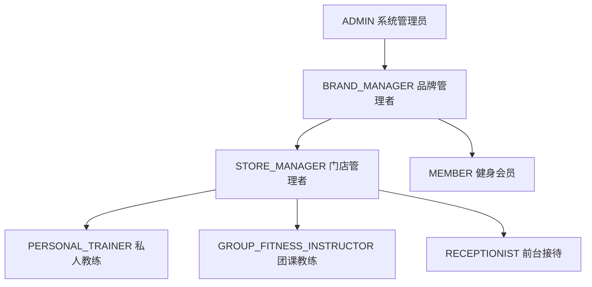

# 健身房SaaS系统架构优化方案

## 📋 目录
- [1. 系统现状分析](#1-系统现状分析)
- [2. 角色业务关系梳理](#2-角色业务关系梳理)
- [3. 数据库优化方案](#3-数据库优化方案)
- [4. 各端功能交互优化](#4-各端功能交互优化)
- [5. 实施路线图](#5-实施路线图)

## 1. 系统现状分析

### 1.1 当前架构优势
✅ **完善的多租户架构**：Brand -> Store -> User 层级清晰  
✅ **灵活的权限系统**：Role-Permission 动态分配  
✅ **业务类型区分**：私教、团课、工作坊分离  
✅ **预约系统完整**：支持不同业务类型的预约流程  
✅ **卡券系统独立**：私教卡、团课卡、会籍卡分别管理  

### 1.2 待优化问题
❌ **教练角色粗粒度**：COACH角色未细分专业类型  
❌ **权限分配不够精细**：缺少基于业务类型的权限控制  
❌ **业务流程交叉**：私教和团课业务边界模糊  
❌ **数据隔离不完善**：跨业务类型的数据访问控制  

## 2. 角色业务关系梳理

### 2.1 核心角色重新定义



### 2.2 角色权限矩阵

| 角色 | 私教业务 | 团课业务 | 会员管理 | 卡券管理 | 财务管理 |
|------|----------|----------|----------|----------|----------|
| ADMIN | ✅ 全部 | ✅ 全部 | ✅ 全部 | ✅ 全部 | ✅ 全部 |
| BRAND_MANAGER | ✅ 查看/统计 | ✅ 查看/统计 | ✅ 查看/统计 | ✅ 查看/统计 | ✅ 查看/统计 |
| STORE_MANAGER | ✅ 管理 | ✅ 管理 | ✅ 管理 | ✅ 管理 | ✅ 查看/统计 |
| PERSONAL_TRAINER | ✅ 执行 | ❌ 无权限 | ✅ 查看(分配) | ✅ 使用(私教卡) | ❌ 无权限 |
| GROUP_FITNESS_INSTRUCTOR | ❌ 无权限 | ✅ 执行 | ✅ 查看(课程) | ✅ 使用(团课卡) | ❌ 无权限 |
| RECEPTIONIST | ✅ 预约/签到 | ✅ 预约/签到 | ✅ 服务 | ✅ 销售/激活 | ❌ 无权限 |
| MEMBER | ✅ 预约/评价 | ✅ 预约/评价 | ✅ 个人信息 | ✅ 查看/使用 | ❌ 无权限 |

### 2.3 业务流程重新设计

#### 私教业务流程
```
1. 私人教练创建私教课程 (Course.type = 'personal')
2. 会员购买私教卡 (PersonalTrainingCard)
3. 私教卡分配给指定教练 (PersonalTrainingCard.coachId)
4. 会员预约私教课程 (Booking, 无需CourseSchedule)
5. 私人教练确认预约
6. 课程执行与签到
7. 私教卡扣次 (PersonalTrainingCard.use())
8. 课程评价与结算
```

#### 团课业务流程
```
1. 团课教练创建团课课程 (Course.type = 'group')
2. 团课教练设置课程排期 (CourseSchedule)
3. 会员购买团课卡 (GroupClassCard)
4. 会员预约团课时段 (Booking.courseScheduleId)
5. 系统自动确认预约
6. 课程执行与批量签到
7. 团课卡扣次 (GroupClassCard.use())
8. 课程评价与结算
```

## 3. 数据库优化方案

### 3.1 Coach实体扩展
```typescript
// 在 coach.entity.ts 中添加
@Column({
  type: 'enum',
  enum: ['personal', 'group', 'both'],
  default: 'both',
  comment: '教练专业类型',
})
specializationType: 'personal' | 'group' | 'both';

@Column({
  type: 'jsonb',
  nullable: true,
  comment: '教练业务配置',
})
businessSettings?: {
  personalTraining?: {
    hourlyRate: number;
    availableHours: string[];
    maxDailyClients: number;
  };
  groupFitness?: {
    maxClassSize: number;
    specialtyClasses: string[];
    preferredTimeSlots: string[];
  };
};
```

### 3.2 新增角色定义
```typescript
// 在 seed.service.ts 中更新角色数据
const rolesData = [
  // ... 现有角色
  {
    name: 'PERSONAL_TRAINER',
    displayName: '私人教练',
    description: '专门负责一对一私教课程服务',
    type: 'system' as const,
    priority: 75,
  },
  {
    name: 'GROUP_FITNESS_INSTRUCTOR',
    displayName: '团课教练',
    description: '专门负责团体课程教学',
    type: 'system' as const,
    priority: 75,
  },
];
```

### 3.3 权限细化定义
```typescript
// 新增权限定义
const newPermissions = [
  // 私教专属权限
  {
    name: 'personal_training:execute',
    displayName: '执行私教课程',
    group: '私教管理',
    resource: 'personal_training',
    action: 'execute',
  },
  {
    name: 'personal_training_card:use',
    displayName: '使用私教卡',
    group: '私教管理',
    resource: 'personal_training_card',
    action: 'use',
  },
  // 团课专属权限
  {
    name: 'group_class:execute',
    displayName: '执行团课',
    group: '团课管理',
    resource: 'group_class',
    action: 'execute',
  },
  {
    name: 'course_schedule:manage',
    displayName: '管理课程排期',
    group: '团课管理',
    resource: 'course_schedule',
    action: 'manage',
  },
];
```

### 3.4 数据表关系优化
```sql
-- 添加教练专业类型索引
CREATE INDEX idx_coaches_specialization ON coaches(specialization_type, store_id);

-- 添加课程类型与教练类型的关联约束
ALTER TABLE courses ADD CONSTRAINT chk_course_coach_type 
CHECK (
  (type = 'personal' AND coach_id IN (
    SELECT id FROM coaches WHERE specialization_type IN ('personal', 'both')
  )) OR
  (type = 'group' AND coach_id IN (
    SELECT id FROM coaches WHERE specialization_type IN ('group', 'both')
  ))
);
```

## 4. 各端功能交互优化

### 4.1 后端API优化

#### 教练管理API扩展
```typescript
// coaches.controller.ts 新增接口
@Get('by-specialization/:type')
@ApiOperation({ summary: '按专业类型获取教练列表' })
getCoachesBySpecialization(
  @Param('type') type: 'personal' | 'group',
  @CurrentUser() user: User
) {
  return this.coachesService.findBySpecialization(type, user);
}

@Post(':id/assign-specialization')
@ApiOperation({ summary: '分配教练专业类型' })
assignSpecialization(
  @Param('id') id: string,
  @Body() dto: { specializationType: 'personal' | 'group' | 'both' },
  @CurrentUser() user: User
) {
  return this.coachesService.updateSpecialization(id, dto.specializationType, user);
}
```

#### 权限控制中间件
```typescript
// 新增业务类型权限装饰器
@BusinessTypeGuard('personal')
@Post('personal-training/create')
createPersonalTraining(@Body() dto: CreatePersonalTrainingDto) {
  // 只有私人教练可以访问
}

@BusinessTypeGuard('group')
@Post('group-class/schedule')
createGroupClassSchedule(@Body() dto: CreateScheduleDto) {
  // 只有团课教练可以访问
}
```

### 4.2 前端管理系统优化

#### 角色管理界面
```vue
<!-- CoachManagement.vue -->
<template>
  <div class="coach-management">
    <!-- 教练类型筛选 -->
    <el-tabs v-model="activeTab" @tab-click="handleTabChange">
      <el-tab-pane label="全部教练" name="all"></el-tab-pane>
      <el-tab-pane label="私人教练" name="personal"></el-tab-pane>
      <el-tab-pane label="团课教练" name="group"></el-tab-pane>
    </el-tabs>
    
    <!-- 教练列表 -->
    <el-table :data="coaches" stripe>
      <el-table-column prop="name" label="姓名"></el-table-column>
      <el-table-column prop="specializationType" label="专业类型">
        <template #default="{ row }">
          <el-tag :type="getSpecializationTagType(row.specializationType)">
            {{ getSpecializationText(row.specializationType) }}
          </el-tag>
        </template>
      </el-table-column>
      <el-table-column label="操作">
        <template #default="{ row }">
          <el-button @click="editSpecialization(row)">编辑专业</el-button>
        </template>
      </el-table-column>
    </el-table>
  </div>
</template>
```

### 4.3 小程序端优化

#### 会员端 - 教练选择优化
```javascript
// pages/booking/booking.js
Page({
  data: {
    courseType: 'personal', // personal | group
    availableCoaches: [],
    selectedCoach: null,
  },
  
  onLoad(options) {
    this.setData({ courseType: options.type || 'personal' });
    this.loadCoachesByType();
  },
  
  async loadCoachesByType() {
    const { courseType } = this.data;
    try {
      const coaches = await api.getCoachesBySpecialization(courseType);
      this.setData({ availableCoaches: coaches });
    } catch (error) {
      wx.showToast({ title: '加载教练失败', icon: 'error' });
    }
  },
});
```

#### 门店端 - 角色权限控制
```javascript
// pages/courses/courses.js
Page({
  data: {
    userRole: '',
    canManagePersonalTraining: false,
    canManageGroupClass: false,
  },
  
  onLoad() {
    this.checkUserPermissions();
  },
  
  checkUserPermissions() {
    const userInfo = wx.getStorageSync('userInfo');
    const roles = userInfo.roles || [];
    
    this.setData({
      userRole: roles[0]?.name || '',
      canManagePersonalTraining: this.hasPermission(roles, 'personal_training'),
      canManageGroupClass: this.hasPermission(roles, 'group_class'),
    });
  },
  
  hasPermission(roles, businessType) {
    return roles.some(role => 
      role.name === 'STORE_MANAGER' ||
      (businessType === 'personal_training' && role.name === 'PERSONAL_TRAINER') ||
      (businessType === 'group_class' && role.name === 'GROUP_FITNESS_INSTRUCTOR')
    );
  },
});
```

## 5. 实施路线图

### 阶段一：数据库结构优化 (1-2周)
1. **Coach实体扩展**
   - 添加specializationType字段
   - 添加businessSettings配置
   - 创建数据迁移脚本

2. **角色权限细化**
   - 新增PERSONAL_TRAINER和GROUP_FITNESS_INSTRUCTOR角色
   - 细化权限定义
   - 更新种子数据

### 阶段二：后端API优化 (2-3周)
1. **教练管理服务扩展**
   - 实现按专业类型查询
   - 添加专业类型分配功能
   - 权限控制中间件

2. **业务流程优化**
   - 私教预约流程优化
   - 团课排期管理优化
   - 卡券使用权限控制

### 阶段三：前端界面适配 (2-3周)
1. **管理系统优化**
   - 教练管理界面重构
   - 权限控制界面优化
   - 业务数据统计分离

2. **小程序端优化**
   - 会员端教练选择优化
   - 门店端权限控制
   - 业务流程界面分离

### 阶段四：测试与部署 (1-2周)
1. **功能测试**
   - 角色权限测试
   - 业务流程测试
   - 数据一致性测试

2. **性能优化**
   - 数据库查询优化
   - 缓存策略调整
   - 接口性能测试

## 6. 风险评估与应对

### 6.1 技术风险
- **数据迁移风险**：现有数据的兼容性处理
- **权限控制复杂度**：细粒度权限可能影响性能
- **业务逻辑变更**：现有业务流程的向后兼容

### 6.2 应对策略
- **渐进式迁移**：分批次进行数据和功能迁移
- **权限缓存**：实现权限结果缓存机制
- **版本兼容**：保持API向后兼容性

## 7. 预期收益

### 7.1 业务收益
- **专业化服务**：教练专业分工提升服务质量
- **运营效率**：精细化权限控制提升管理效率
- **用户体验**：清晰的业务流程提升用户满意度

### 7.2 技术收益
- **系统可维护性**：清晰的角色职责边界
- **扩展性**：灵活的权限系统支持业务扩展
- **数据安全性**：细粒度权限控制保障数据安全

---

**文档版本**：v1.0  
**创建日期**：2024年12月  
**维护人员**：开发团队  
**更新周期**：每月更新